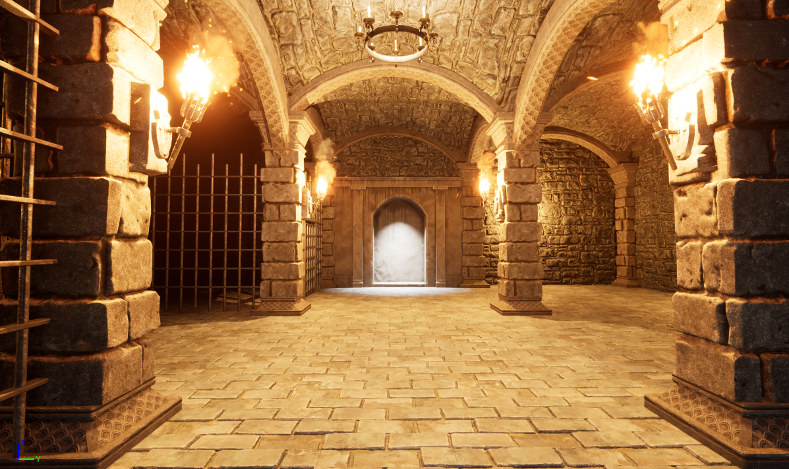

    <h1><strong>Crypt Raider</strong></h1>

## **Description**

Crypt Raider is a first-person puzzle game project I worked on using Unreal Engine 5 and C++. The Objective of this game is for the player to reach the end of the crypt and successfully leave with the golden statue. The player will have to discover secrets and solve puzzles to accomplish this task.
  
This is one of the projects in a series of projects that I have worked on when I took an Unreal Engine 5 Video Game Development course on Udemy.

## **Project Features**
- Modular Level Design
- Trigger Collision and Detection
- Overlap Events
- Grabbing & Dropping Game Objects
- Lighting (Skylight, Directional & Spotlight)

## **Controls**
- <strong>Move Forward:</strong> Press the "W" key
- <strong>Move Left:</strong> Press the "A" key
- <strong>Move Backwards:</strong> Press the "S" key
- <strong>Move Right:</strong> Press the "D" key
- <strong>Grab Object:</strong> Hold "LMB" (Left Mouse Button)
- <strong>Release Object:</strong> Release "LMB" (Left Mouse Button)

## **Tools & Assets**
- C++ Programming Language
- Unreal Engine 5
- Medieval Dungeon Asset Pack

