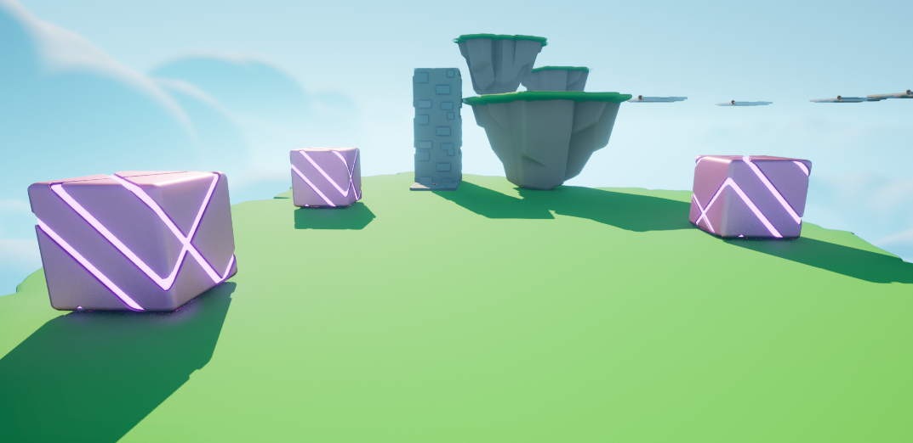

    <h1><strong>Obstacle Assault</strong></h1>

## **Description**

Obstacle Assault is a third-person video game project I worked on using Unreal Engine 5 and C++. It also implements gameplay using Unreal Engine's Blueprint feature. The objective of this game is to reach the end location while avoiding obstacles and falling down.
  
This is one of the projects in a series of projects that I have worked on when I took an Unreal Engine 5 Video Game Development course on Udemy.

## **Project Features**
- Level Design
- UI
- Game End Conditions for Winning and Losing
- Player movement & Game Loop using Blueprints
- Moving Obstacles using C++

## **Controls**
- <strong>Move Forward:</strong> Press the "W" key
- <strong>Move Left:</strong> Press the "A" key
- <strong>Move Backwards:</strong> Press the "S" key
- <strong>Move Right:</strong> Press the "D" key
- <strong>Jump:</strong> Press the "Space Bar" key

## **Tools & Assets**
- C++ Programming Language
- Unreal Engine 5
- "Unreal Learning Kit: Games" Asset Pack
- "Stylized Character Kit: Casual 01" Asset Pack
