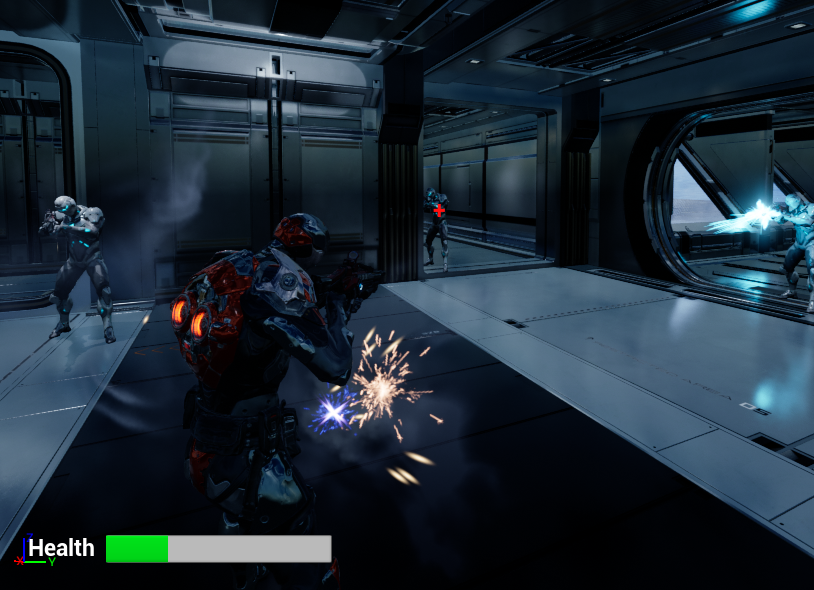

    <h1><strong>Simple Shooter</strong></h1>

## **Description**

Simple Shooter is a third-person video game project I worked on using Unreal Engine 5 and C++. The objective of this game is to eliminate all enemy threats in the level. The player must also do this while avoiding enemy projectiles and losing all of their health.
  

This is one of the projects in a series of projects that I have worked on when I took an Unreal Engine 5 Video Game Development course on Udemy.

## **Project Features**
- UI
- Enemy AI
    - Aiming & Line of Sight
    - Nav Mesh and Enemy Movement
    - Behavior Trees and Sequences
- Animation
- Sound Effects
- Particle Effects

## **Controls**
- <strong>Move Forward:</strong> Press the "W" key
- <strong>Move Left:</strong> Press the "A" key
- <strong>Move Backwards:</strong> Press the "S" key
- <strong>Move Right:</strong> Press the "D" key
- <strong>Jump:</strong> Press the "Space Bar" key
- <strong>Fire Weapon:</strong> Press the "LMB" (Left Mouse Button)

## **Tools & Assets**
- C++ Programming Language
- Unreal Engine 5
- Shooter Asset Pack (Udemy)