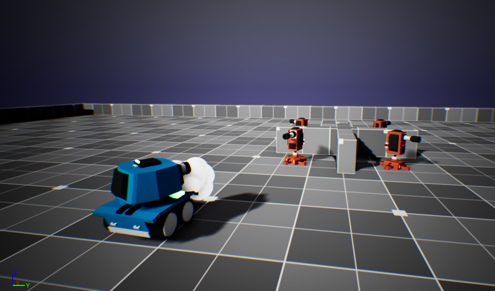

    <h1><strong>Toon Tanks</strong></h1>

## **Description**

Toon Tanks is a third person video game project I worked on using Unreal Engine 5 and C++. In this game, you are a tank with the objective of destroying all enemy turrets in the level. You must do so by firing projectile shells at them while avoiding getting hit by the turret projectiles.
  
This is one of the projects in a series of projects that I have worked on when I took an Unreal Engine 5 Video Game Development course on Udemy.

## **Project Features**
- UI
- Turret Targeting
- Game End conditions for Winning and Losing
- Camera Movement & Shake
- Sound Effects

## **Controls**
- <strong>Move Forward:</strong> Press the "W" key
- <strong>Move Left:</strong> Press the "A" key
- <strong>Move Backwards:</strong> Press the "S" key
- <strong>Move Right:</strong> Press the "D" key
- <strong>Fire:</strong> Press the "LMB" (Left Mouse Button) key

## **Tools & Assets**
- C++ Programming Language
- Unreal Engine 5
- "Toon Tanks Asset Pack" (Udemy)
