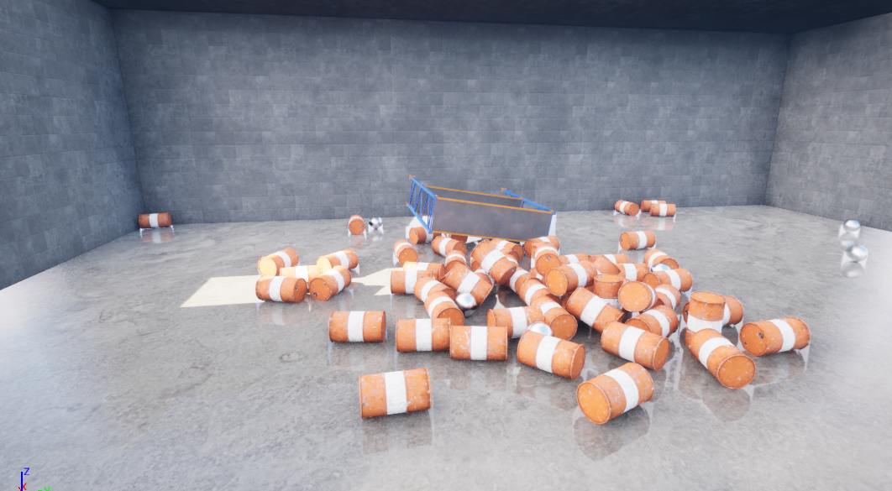

    <h1><strong>Warehouse Wreckage</strong></h1>

## **Description**

Warehouse Wreckage is a first-person video game project I worked on using Unreal Engine 5 and C++. In this game, the player can shoot heavy projectiles using the "Space Bar" key. The player has a limit of 20 shots and is free to shoot anywhere in the level (preferably at the barrels to showcase the physics). When ammunition is depleted, the level will restart.
  
This is one of the projects in a series of projects that I have worked on when I took an Unreal Engine 5 Video Game Development course on Udemy.

## **Project Features**
- Spawning Projectiles using player Input
- Level Design using Geometry Brushes
- Level loading using delay timers
- Materials & Lighting
- Gameplay done through Blueprints

## **Controls**
- <strong>Move Forward:</strong> Press the "W" key
- <strong>Move Left:</strong> Press the "A" key
- <strong>Move Backwards:</strong> Press the "S" key
- <strong>Move Right:</strong> Press the "D" key

## **Tools & Assets**
- C++ Programming Language
- Unreal Engine 5
- "Industry Prop Pack 6" Asset Pack